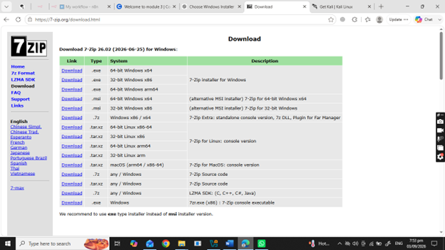
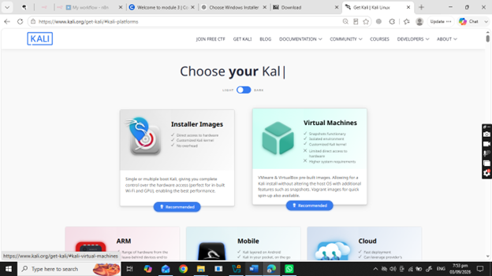
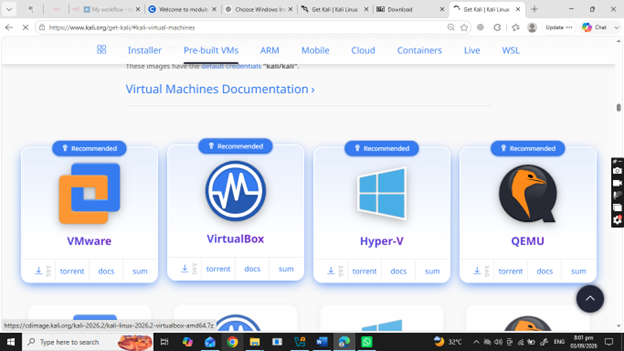
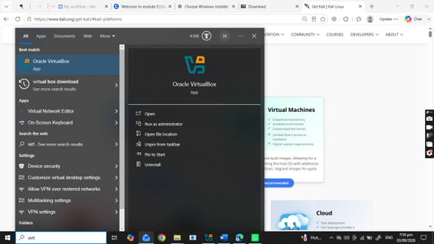
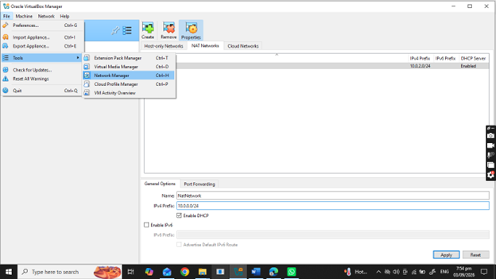
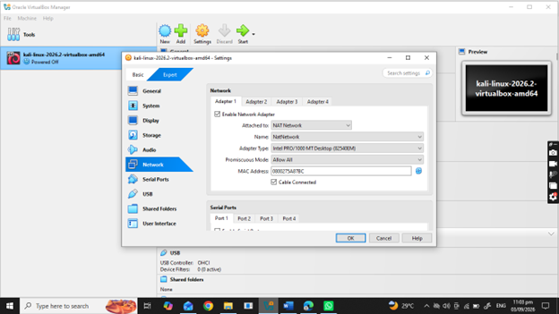
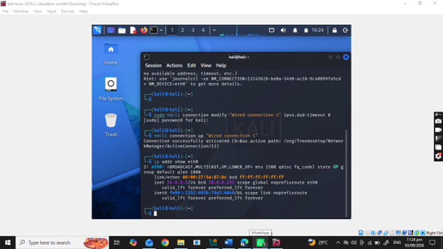
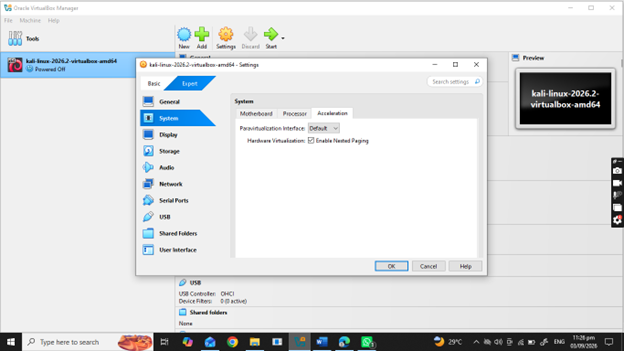
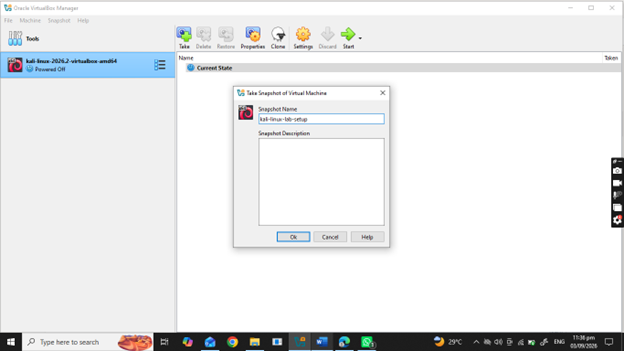

# 🔐 Cybersecurity and Pen testing Lab Setup
## 📌 Project Overview

This project focuses on setting up a basic cybersecurity laboratory using Oracle VirtualBox and Kali Linux.

The purpose of the lab is to create a controlled environment where cybersecurity tools, network scanning, reconnaissance, vulnerability assessment, and other security-testing activities can be performed safely and repeatedly.

The laboratory uses a dedicated virtual network so that additional virtual machines can be added later for authorized cybersecurity practice.

---

## 🎯 Objectives

The main objectives of this project are:

- Install the required tools for the virtual lab.
- Set up Oracle VirtualBox.
- Download and configure Kali Linux.
- Create and configure a virtual network using VirtualBox.
- Configure the Kali Linux network connection.
- Assign the required IPv4 address, gateway, and DNS settings.
- Verify the network configuration.
- Document the setup process and troubleshooting experience.
- Prepare the environment for future cybersecurity exercises.

## 🏗️ Lab Environment

The laboratory environment consists of the following components:

| Component | Configuration |
|---|---|
| Hypervisor | Oracle VirtualBox |
| Security OS | Kali Linux 2026.2 |
| Virtual Network | NatNetwork |
| Kali RAM | 2048 MB |
| Kali IPv4 Address | 10.0.0.2/24 |
| Gateway | 10.0.0.1 |
| DNS Server | 8.8.8.8 |
| Network Configuration Tool | NetworkManager / `nmcli` |

## 🛠️ Tools Used

The following tools were used during the lab setup:

| Tool | Purpose |
|---|---|
| 7-Zip | Used for working with compressed files. |
| Oracle VirtualBox | Used as the virtualization platform. |
| Kali Linux | Used as the cybersecurity-focused operating system. |
| NetworkManager / `nmcli` | Used to configure the Kali Linux network connection. |
## Lab Setup Procedure
### Step 1: Download 7-Zip

7-Zip was downloaded as part of the preparation for working with compressed files required during the lab setup.

The screenshot in the project documentation shows the 7-Zip download page with different available versions and platforms.

### Step 2: Download Kali Linux

Kali Linux was obtained from the official Kali Linux download page.

The Kali download page provides different installation options, including Installer Images and Virtual Machines.

For this lab, the virtual-machine approach was used because Kali Linux was going to run inside Oracle VirtualBox.

The screenshot shows the Kali Linux download page and the available options for obtaining Kali Linux.

### Step 3: Select VirtualBox as the Virtualization Platform

The Kali Linux virtual-machine download page provides several virtualization platforms.

For this project, VirtualBox was selected as the virtualization platform.

The screenshot shows VirtualBox among the available virtualization platforms for Kali Linux virtual machines.

### Step 4: Open Oracle VirtualBox

After installing/configuring Oracle VirtualBox, the VirtualBox Manager was opened.

The Kali Linux virtual machine was available in the VirtualBox Manager and could be managed from the main interface.

The screenshot shows the VirtualBox Manager with the Kali Linux virtual machine and its configuration details.

### 🌐 Step 5: Configure the Virtual Network

A virtual network named NatNetwork was configured in Oracle VirtualBox.

This network provides the virtual networking environment required for the Kali Linux VM.

The Kali Linux VM was then connected to this virtual network through its network adapter.This was done by opening the Kali Linux VM settings, selecting **Network** from the left-side menu, and setting the network attachment type to **NAT Network**.

The screenshot shows the VirtualBox network configuration interface and the NatNetwork network.

### 🖥️ Step 6: Configure Kali Linux Virtual Machine

The Kali Linux virtual machine was configured in VirtualBox.

The VM configuration included the required system resources and network adapter settings.

The VM was allocated **2048 MB of RAM**.

The screenshot shows the Kali Linux VM settings, including the system configuration and network adapter configuration.

### ⚙️ Step 7: Configure Kali Linux Network

During the network configuration process, the graphical Edit Connection option was not available.

Because of this limitation, the network configuration was performed using the NetworkManager command-line utility (nmcli).

The following network parameters were configured:

| Setting | Value |
|---|---|
| **IP Address** | `10.0.0.2/24` |
| **Gateway** | `10.0.0.1` |
| **DNS** | `8.8.8.8` |

The connection was then restarted using NetworkManager commands.

The configuration was successfully activated and the IP address was verified using:

**ip addr show eth0**

The screenshot shows the Kali Linux terminal where the network configuration was performed using NetworkManager commands.

### ⚙️ Step 8: Configure Hardware Virtualization

Before starting the Kali Linux virtual machine, the VirtualBox system acceleration settings were checked.

Under **System → Acceleration**, the virtualization acceleration settings were checked and **Enable Nested Paging** was selected.

### ⚙️ Step 9: VM snapshot
After completing all the above steps,a snapshot of the Kali Linux virtual machine was created to preserve the current working configuration.

The snapshot can be used as a recovery point if any configuration changes or issues occur during future lab activities.

## 🐞 Problem Encountered & Solution
### Problem: Graphical Network Configuration Option Unavailable

While configuring the Kali Linux IP address, the graphical “Edit Connection” option was not available.

As a result, the IPv4 settings could not be configured through the graphical interface.

### Solution

To resolve the issue, the NetworkManager command-line utility (nmcli) was used.

The required network parameters were manually configured:

| Setting | Value |
|---|---|
| **IP Address** | `10.0.0.2/24` |
| **Gateway** | `10.0.0.1` |
| **DNS** | `8.8.8.8` |
The network connection was then restarted using:

**nmcli connection down**
**nmcli connection up**

Finally, the configuration was verified using:

**ip addr show eth0**

The connection was successfully activated and the required IP address was assigned.

## 📚 What I Learned

Through this lab setup, I learned several practical concepts related to virtualization and cybersecurity environments.

### 1. Virtual Machine Setup

I learned how to prepare and run a Kali Linux virtual machine using Oracle VirtualBox.

### 2. Virtual Networking

I learned how to create and configure a virtual network and connect a virtual machine to that network.

### 3. Linux Network Configuration

I learned how IPv4 addressing, gateways, and DNS settings are configured in Kali Linux.

### 4. Using nmcli

When the graphical network configuration option was unavailable, I learned how to use the NetworkManager command-line utility to configure the network manually.

### 5. Network Verification

I learned how to verify the assigned IP address using:

ip addr show eth0
### 6. Troubleshooting

The network configuration problem helped me understand that Linux networking can be configured through both graphical interfaces and command-line utilities.

## 🔗 Resources
- [7-Zip Official Website](https://www.7-zip.org/)
- [VirtualBox Official Website](https://www.virtualbox.org/)
- [Kali Linux Official Website](https://www.kali.org/)
  
## 👤 Author

**HAMDA RAZA**

Remote Cybersecurity Intern

## 📌 Project Information

| Information | Details |
|---|---|
| **Program Name** | Cybersecurity at Networkwalks |
| **Week** | 01 |
| **Project** | Cybersecurity Lab Setup |

## ✅ Conclusion

The Week 1 cybersecurity lab setup was completed using Oracle VirtualBox and Kali Linux.

The lab environment was configured with a dedicated NAT Network, and the Kali Linux VM was assigned the required IP address, gateway, and DNS settings.

During the setup, the graphical network configuration option was unavailable, so the network was configured manually using `nmcli`. The connection was successfully activated and the IP configuration was verified.

This environment provides a foundation for future cybersecurity learning and authorized security-testing activities.

### 🔗 Connect

**LinkedIn:** [Hamda Raza](https://www.linkedin.com/in/hamda-rashid-67a157356/)

